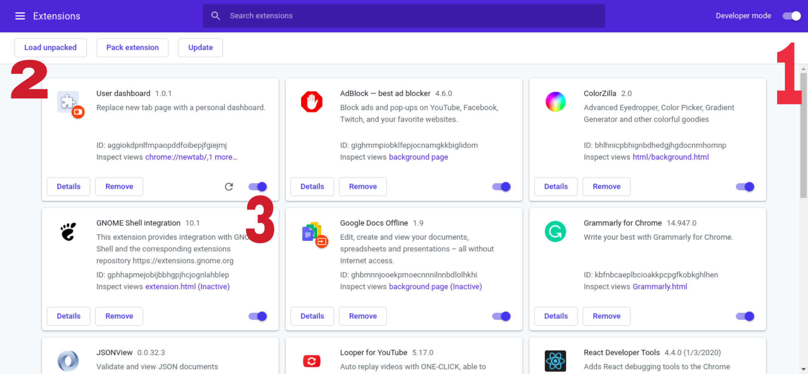

# User-Dashboard
It replaces browser's new tab page with the personal dashboard.


# Getting started
Below instructions will give you a local version of `user-dashboard-extension` up and running, assuming that you have `node` and `npm` installed:
```
git clone https://github.com/poojakp94/user-dashboard-extension.git

cd user-dashboard-extension/

npm install
```
In the project directory, you can run:

### `npm start`

Runs the app in the development mode.<br />
Open [http://localhost:3000](http://localhost:3000) to view it in the browser.

### `Using locally for Chrome`
All you need to do is to run `npm run build` to put everything required into `build` folder, than launch `chrome://extensions/` in Google Chrome.



1. Make sure developer mode is on as shown on the image above(1).
2. Click "Load unpacked" and target "build" folder in your project, it should contain `index.html`, `manifest.json`, and bundle javascript files(2).
3. Make sure other extensions like `Unsplash Instant` which also modify new tab is disabled(3).

Opening a new tab should allow you to test your shiny new extension!

To update the extension, you will need to change the code, run `npm run build` again, and click the "Refresh" button.


